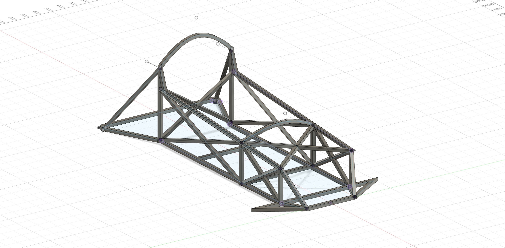
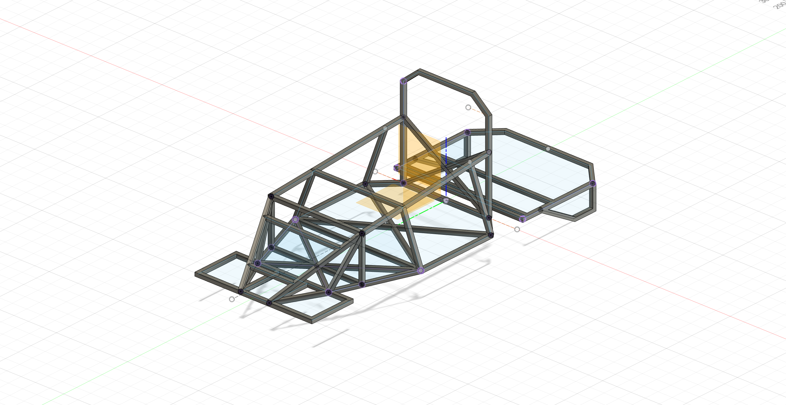

# Day 1 – What Did I Just Sign Up For?

So, I sat down on day one and thought: *Okay... why am I actually doing this?*  
I'm trying to build what’s basically a mini Formula 1 car—from scratch—with a **motorcycle engine**. Sounds a little insane, right? But that’s kind of the point. It’s not supposed to be easy. It’s supposed to be awesome.

## What I’m Aiming For

- It should actually **look and feel** like a race kart, not like just some janky box on wheels  
- Powered by a **motorcycle engine**, because I want speed (and maybe a little chaos), also cuz its the most avalible thing here in cairo
- Stick to a budget of around **$350 USD** (yeah, I know... good luck to me)  
- Be safe enough that I don’t, you know, die while testing it 😅  

Out of all of these, the budget might be the most optimistic part. But I kind of love the idea of proving that you don’t need a ton of money to build something fast and fun.

---

Naturally, I started where every good DIY project begins: **a full-on YouTube binge**.  
I went deep—sketchy garage builds, backyard engineering, the whole thing. I also found some solid stuff like [CarsandCameras](https://www.youtube.com/@carsandcameras) on YouTube, plus a bunch of Reddit posts and forums where people broke down their entire process.

## Go-Kart Basics I Picked Up

- The frame needs to be **strong but light**—no flexing at speed  
- Rear axle with **sprockets, brakes**, and *maybe* a differential  
- **Steering geometry** that actually lets the kart turn (kinda important)  
- A **throttle and brake setup** that doesn’t explode when I hit 60 km/h  
- Engine mounting + gearing = possibly the biggest headache ahead  

---

I didn’t actually build anything yet.  
(Okay, if I’m being honest, this “day” was more like a week of late-night rabbit holes.)

**Time spent today: 5 hours ish idk tbh :sob:**

# Day 2 – The Great Part Hunt Begins

Alright—today was all about **figuring out what I actually need** to start building this beast. Turns out, it's not as simple as "just grab a motorcycle engine and go." Shocking, I know.

So I cracked open a fresh Notion page and started putting together a parts list. Frame, engine, wheels, brakes, throttle—everything. Some of it I knew right away. Other stuff? I had to Google like 15 different ways just to figure out what it was even called.

## The Essentials I’m Looking For

- **Engine** – Ideally something between 125cc–200cc. Cheap. Alive. Not picky.
- **Rear axle** – Needs to fit sprockets, a brake disc, and maybe a differential. (still debating)
- **Wheels & tires** – Something low-profile and wide-ish. Go-kart wheels or small quad tires.(might change my mind idk)
- **Brake system** – In order not to die.
- **Throttle & brake cables** – Bonus points if they don’t snap on day one.
- **Steering parts** – Tie rods, spindles, steering shaft, maybe a rack and pinion setup?
- **Seat** – Because I enjoy sitting while driving, i dont want to be standing uk.

## Marketplace Miracle (Kinda)

After a *ton* of scrolling, I actually found a few **old motorcycles in the $200 range** on Facebook Marketplace. They’re all pretty rough around the edges—rusty frames, cracked plastics, sketchy paint jobs—but a couple of them actually run. That’s all I really need.

If I can snag one that’s running, I’ll have a working engine, a wiring harness, maybe usable brakes, and a few other parts I can strip and reuse. It’s way cheaper than buying everything separately, and honestly, kind of a win.

Trying to narrow it down and schedule a visit or two this week.

## Where I’m Still Looking

- **Facebook Marketplace** – A goldmine of weird and useful stuff.  
- **Downtown Cairo repair and parts shops** –I’m planning a trip soon to hit up some local shops and see what random parts and bargains I can find.

---

Getting close!

# Day 3 – Bill of Materials & Donor Bike Breakdown

Today I started getting serious about what parts I’ll need and how much this whole thing is actually going to cost. Spoiler: It’s a little more than my $350 USD budget, but the donor bike helps a lot.

I made a rough Bill of Materials (BOM) with prices I found online, local shops, and what I can get from the donor bike.

## Expected Parts from Donor Bike (~10000EGP)

- Engine (125cc–200cc, 4-stroke) — **Included**  
- Wiring harness — **Included**  
- Throttle and brake cables — **Included**  
- Rear sprocket and chain — **Included**  
- Brake caliper and disc — **Included**  
- Wheels (if usable) — Might not fit the style of the go kart i want, but it might work
- Controls (handlebars, levers) — **Included**  
- Frame parts (might salvage some metal pieces) — Maybe

---
## Bill of Materials (Estimated Prices in EGP)

| Part                      | Estimated Cost (EGP) | Notes                                |
|---------------------------|---------------------|-------------------------------------|
| Motorcycle engine + parts | 10,000              | Donor bike price                    |
| Frame tubing (steel)      | 2,500               | Local metal shop                    |
| Rear axle & sprockets     | 1,100               | Might buy aftermarket or salvage    |
| Brake system              | 1,000               | Might buy new or salvage from bike  |
| Seat                      | 200                 | Basic go-kart seat                  |
| Throttle/brake cables     | Included            | From donor bike                     |
| Extras                    | 300                 | Because it has to look cool         |
| Wheels & tires            | IDK yet             | TBD                                 |
| Steering components       | IDK yet             | TBD                                 |
| Misc hardware             | IDK yet             | TBD                                 |

**Ill edit this once i know**

---

So far, the donor bike looks like a solid deal since it covers most of the expensive engine and controls parts. The rest I’ll have to hunt down and piece together bit by bit.

Next step: start planning the frame design around these parts and maybe begin cutting some tubing.

This is getting real!

# Day 4 – Designing the Frame

Alright, today was all about **getting my hands dirty with some serious planning** — designing the go-kart frame. After staring at piles of tubing and parts lists, I finally sat down with a notebook, ruler, and a bunch of online references.

Also thanks alot to **Kai** — he helped me a ton with CAD since this was my first time using it. Honestly, I would’ve been lost without their guidance navigating the software and turning my sketches into something real.

## What I’m aiming for

- A frame that looks **fast**.
- Geometry that **makes steering smooth and predictable** — no one wants to drive a go-kart that fights you.
- Space to **fit the donor bike engine, rear axle, and brakes** without a million hacks.
- Something where I have my legs streched all the way, without bending it (felt like it looked cool).

## The design process

I sketched out a rough frame plan, starting with the main chassis rails. I’m thinking of a rectangular shape with some cross braces for strength. The engine will sit low and towards the back to keep the center of gravity down.

## Challenges ahead

- Figuring out the **exact dimensions** to make everything fit right.
- Deciding how to **attach the engine and axle** solidly.
- Making sure the frame won’t **bend or flex too much**.

---

That’s it for today—I wrapped up the frame design! Thanks again to Kai for the CAD help, seriously couldn’t have done it without you.

Feeling good about the plan, and now I’ve got a solid blueprint to work from.

Next up: Submitting and buying everything (cant wait!!)

# Day 5 – Complete Frame Redesign

Today was a big one: I ended up **completely redesigning the frame** from scratch.

After looking over my sketches and some CAD mockups, I realized the original design just wasn’t going to cut it. The proportions felt off, the engine placement was awkward, and there wasn’t enough room for the steering setup I wanted. Plus, I wanted something that was a bit more practical when transporting it.

So, I went back to the drawing board—literally. I spent a few hours sketching new ideas, then jumped into CAD (no help from kai this time) This time, I focused on:

- Lowering the seat position for a better center of gravity
- Widening the chassis for more stability and comfort
- Adjusting the engine mount so it fits cleaner and is easier to service
- Making sure there’s enough space for the steering column and pedals
- Adding more cross-bracing for strength without adding too much weight

The new design feels way better than before. I’m way happier with how it looks and functions now.

**Time spent today: 6+ hours (lots of coffee and CAD rage moments)**
